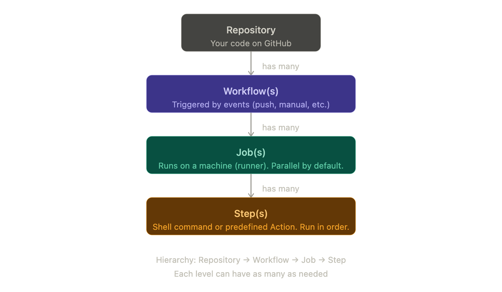

<h2 style="color: #FF6B6B;">GitHub Actions — Complete Notes</h2>

<h3 style="color: #4ECDC4;">What is GitHub Actions?</h3>

GitHub Actions is a feature built into GitHub that lets you **automate tasks** for your code repositories. Think of it as a way to tell GitHub: *"whenever X happens, do Y automatically."*

---

<h3 style="color: #FFE66D;">The 3 Building Blocks</h3>

<h4 style="color: #A8E6CF;">1. Workflow</h4>

- A workflow is an **automated process** you set up for a repository.
- It is **attached to a GitHub repository** — no repo, no workflow.
- You can add **as many workflows as you want** to one repository.
- A workflow is always **triggered by an event** (also called a trigger).

**What are events/triggers?**
These define *when* the workflow should run. Examples:
- Someone pushes code to a branch → workflow runs automatically
- You click a button to start it manually
- A scheduled time (like a cron job)

---

<h4 style="color: #74B9FF;">2. Job</h4>

- A workflow contains **one or more jobs**.
- Each job defines a **runner** — the machine and operating system where it will run.
  - GitHub provides ready-made runners for **Linux, macOS, and Windows**.
  - You can also set up your own custom runner.
- Jobs define **what steps will run** inside that machine environment.

**How do multiple jobs behave?**
- By default, multiple jobs in a workflow **run in parallel** (at the same time).
- You can configure them to run **sequentially** (one after another) if needed.
- Jobs can also be **conditional** — they only run if a certain condition is met.

---

<h4 style="color: #D4A5FF;">3. Step</h4>

- Steps are where the **actual work happens**.
- Every job has **one or more steps**, and they run **in order**, one after another (not in parallel).
- Steps can also be **conditional**.

**A step is either:**
| Type | What it is |
|------|------------|
| Shell command | A simple terminal command, e.g. `npm install` or `python test.py` |
| Action | A pre-built, reusable script that does a specific task. You can use GitHub's actions, third-party actions, or write your own. |

**Example of steps in a typical workflow:**
1. Step 1 → Download the code
2. Step 2 → Install dependencies
3. Step 3 → Run automated tests

---

<h3 style="color: #A3D977;">Hierarchy Overview</h3>

---

<h3 style="color: #FD79A8;">Key Rules to Remember</h3>

| Concept | Rule |
|---------|------|
| Workflows per repo | Unlimited |
| Jobs per workflow | Unlimited |
| Steps per job | At least 1, usually more |
| Step execution | Always in order, never parallel |
| Job execution | Parallel by default, sequential if configured |
| Runner | Every job needs one (Linux/macOS/Windows) |

---

<h3 style="color: #FDCB6E;">Quick Summary in Plain English</h3>

> You have a **repository** on GitHub. You add one or more **workflows** to it. Each workflow has **events** that decide when it runs. Inside the workflow, there are **jobs** — each running on its own machine. Inside each job, there are **steps** — these are the actual commands or scripts that do the real work, running one by one.
