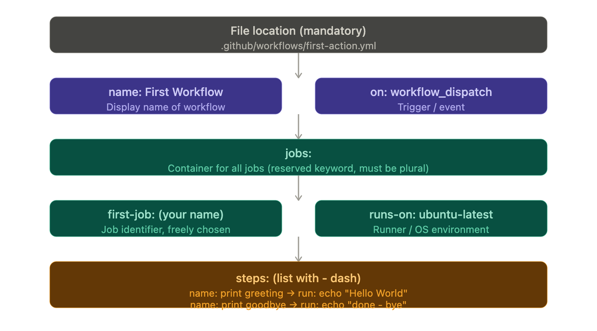

<h2 style="color: #FF9F43;">Creating Your First GitHub Actions Workflow — Complete Notes</h2>

<h3 style="color: #48DBFB;">Setup: Before You Start</h3>

**Account & Plan**
- Any GitHub account works — even the free plan supports GitHub Actions fully.
- You need a GitHub repository to attach workflows to.

**Creating the repository**
- Create a new repo (name doesn't matter — e.g. `gh-first-action`).
- Keep it public.
- Add a README file so the repo has some content from the start.
- No need to connect it to a local repo for this first action — everything is done inside GitHub's browser.

---

<h3 style="color: #1DD1A1;">Where to Find Actions on GitHub</h3>

- Go to your repository → click the **Actions tab**.
- This is where you can view and create workflows for that repository.
- GitHub provides many **ready-made templates** to choose from.
- For a first workflow, choose the **Simple Workflow** template → click Configure.
- You can also create workflow files locally later (covered in later lessons).

---

<h3 style="color: #FF6B6B;">Important Clarification: "Action" vs "Workflow"</h3>

- The Actions tab is sometimes loosely called "actions" but what you are actually creating is a **workflow**.
- A **workflow** is made of jobs and steps — that's the correct term.
- An **action** is a separate, specific feature (a pre-built reusable script) — covered later.

---

<h3 style="color: #FECA57;">The Workflow File: Location & Format</h3>

This is one of the most important things to remember:

**File must be stored at this exact path in your repository:**

```
.github/workflows/your-file-name.yml
```

**Why this path?**
- GitHub automatically detects and runs workflow files only from this location.
- `.github` → folder at root of repo
- `workflows` → subfolder inside `.github`
- `.yml` → YAML format file (YAML = a way of formatting/structuring text using indentation)

**Naming the file:** You can name the file anything (e.g. `first-action.yml`). The file name does not affect behaviour.

---

<h3 style="color: #A29BFE;">Writing the Workflow File from Scratch</h3>

A workflow YAML file has these parts, in order:

<h4 style="color: #74B9FF;">1. `name` — Workflow name</h4>

```yaml
name: First Workflow
```
- `name` is a reserved keyword — it must be written exactly as `name`.
- The value (e.g. `First Workflow`) is what shows up as the display name.
- You can have multiple YAML files in the `workflows` folder — each is a separate workflow with its own name.

---

<h4 style="color: #55EFC4;">2. `on` — The Trigger / Event</h4>

```yaml
on: workflow_dispatch
```
- `on` is a reserved keyword.
- It defines **when** the workflow should run.
- `workflow_dispatch` = lets you **manually trigger** the workflow by clicking a button on GitHub.
- Many other automatic events exist (e.g. on every push to a branch) — covered later.

---

<h4 style="color: #FDCB6E;">3. `jobs` — Container for all jobs</h4>

```yaml
jobs:
```
- `jobs` is a reserved keyword and **must be plural** — writing `job` will not work.
- Does not take a value directly — instead, you move to a new line and indent.
- Indentation in YAML means "this belongs to the thing above it."

---

<h4 style="color: #E17055;">4. Job identifier — Your job's name</h4>

```yaml
  first-job:
```
- Written indented under `jobs`.
- This name is **totally up to you** — e.g. `first-job`, `basic`, `build`, anything.
- This is the only non-reserved identifier in the whole file so far.
- Again, does not take a value directly — you indent further and add details.

---

<h4 style="color: #A8E6CF;">5. `runs-on` — The Runner (execution environment)</h4>

```yaml
    runs-on: ubuntu-latest
```
- `runs-on` is a reserved keyword.
- Defines the **machine and OS** on which this job's steps will run.
- GitHub provides ready-to-use runners — you don't need to set up any server.

**Available runner options (as of recording):**

| OS | Example identifier |
|----|--------------------|
| Linux (Ubuntu) | `ubuntu-latest` |
| Windows Server | `windows-latest` |
| macOS | `macos-latest` |

- You can search "GitHub Actions runners" on GitHub docs for the full current list with hardware specs.
- `ubuntu-latest` is the most common choice.

---

<h4 style="color: #D4A5FF;">6. `steps` — The actual work</h4>

```yaml
    steps:
      - name: print greeting
        run: echo "Hello World"
      - name: print goodbye
        run: echo "done - bye"
```
- `steps` is a reserved keyword.
- Each step starts with a **dash (`-`)** — this is how YAML defines a list item.
- Each step has:
  - `name` → a label for the step (helps you identify it in logs — your choice)
  - `run` → the shell command to execute in the terminal

- Steps run **in order, one after another** (not in parallel).
- You can have as many steps as needed.

---

<h3 style="color: #A3D977;">Workflow Structure Overview</h3>



---

<h3 style="color: #FD79A8;">Reserved vs. Custom Keywords — Quick Reference</h3>

| Keyword | Reserved? | Notes |
|---------|-----------|-------|
| `name` | Yes | Workflow display name |
| `on` | Yes | Event/trigger |
| `jobs` | Yes | Must be plural |
| `runs-on` | Yes | OS environment |
| `steps` | Yes | List of steps |
| `run` | Yes | Shell command inside a step |
| `first-job` | No | Your job identifier — name it anything |
| Step `name` value | No | Your label — name it anything |

---

<h3 style="color: #6C5CE7;">Full Example Workflow (Minimal)</h3>

```yaml
name: First Workflow

on: workflow_dispatch

jobs:
  first-job:
    runs-on: ubuntu-latest
    steps:
      - name: print greeting
        run: echo "Hello World"
      - name: print goodbye
        run: echo "done - bye"
```

This workflow does nothing meaningful yet — but it demonstrates the complete correct structure of a GitHub Actions workflow file.

---

<h3 style="color: #00B894;">Quick Summary</h3>

- Workflows live in `.github/workflows/*.yml`
- Every workflow needs: a `name`, an `on` trigger, and at least one `job` with a `runs-on` and at least one `step`
- YAML uses **indentation** to show what belongs to what
- Steps use a **dash `-`** because they are a list
- Only the job identifier and step names are yours to choose freely — everything else is a reserved keyword

---

<h2 style="color: #E84393;">Running & Monitoring Your Workflow — Complete Notes</h2>

<h3 style="color: #F9CA24;">Saving the Workflow (Committing)</h3>

- After writing your YAML file in the browser editor, you **commit** it to save it.
- This is important to understand: **a workflow file is part of your code/repository** — it is not something stored outside of Git.
- It lives inside your repository in `.github/workflows/` — so saving it = creating a Git commit.
- Every time you add or edit a workflow file, you are technically making a code change to your project.

---

<h3 style="color: #6AB04C;">What Changes in the Actions Tab After Committing</h3>

Once the workflow file is committed and GitHub detects it:

- The **Actions tab** changes its appearance.
- You now see two things:
  - A list of **past workflow runs** (populates as workflows execute over time)
  - A list of **all detected workflows** in your repository

**How does GitHub detect workflows?**
GitHub automatically looks inside the `.github/workflows/` folder and reads every `.yml` file it finds there. Each file = one workflow.

---

<h3 style="color: #22A6B3;">Triggering the Workflow Manually</h3>

- Since we used the `workflow_dispatch` event, a **"Run workflow" button** appears on the Actions tab.
- If you had NOT added `workflow_dispatch`, this button would not appear.
- Click the button → select the branch (e.g. `main`) → the workflow starts running.

---

<h3 style="color: #EB4D4B;">Monitoring a Workflow Run</h3>

Once triggered, you can track the execution from the Actions tab:

**Status indicators:**

| Symbol | Meaning |
|--------|---------|
| Yellow dot | Workflow is currently running |
| Green check mark | Workflow completed successfully |
| Red cross | Workflow failed |

---

<h3 style="color: #9B59B6;">Viewing Run Details</h3>

You can drill down into a workflow run at three levels:

**Level 1 — Workflow run overview**
- Click on the workflow run to see which jobs were part of it.
- You'll see the job name (e.g. `first-job`) and its status.

**Level 2 — Job details**
- Click on the job to see all steps that ran inside it.
- You will see not just the steps you defined, but also **two automatic steps added by GitHub:**

| Step | Added by | Purpose |
|------|----------|---------|
| Setup | GitHub (automatic) | Sets up the runner machine/environment |
| Complete / Cleanup | GitHub (automatic) | Cleans up after the job finishes |
| Your custom steps | You | e.g. print greeting, print goodbye |

**Level 3 — Step details**
- Expand any step to see exactly what command ran and what output it produced.
- Example: expanding `print greeting` shows `echo "Hello World"` and its output.
- Same for `print goodbye` — shows `echo "done - bye"` and its result.

---

<h3 style="color: #3498DB;">Re-running the Workflow</h3>

- You can trigger the workflow **as many times as you want**.
- Just go back to the workflow on the Actions tab → click Run workflow again.
- Each run is logged separately and you can view its details independently.

---

<h3 style="color: #E67E22;">Key Takeaway</h3>

> GitHub Action workflows are **part of your code**. They are defined in files inside your Git repository — not outside of it. Every change to a workflow = a Git commit.

---

<h2 style="color: #1ABC9C;">Running Multiple Shell Commands</h2>

Thus far, you learned how to run simple shell commands like `echo "Something"` via `run: echo "Something"`.

If you need to run multiple shell commands (or multi-line commands, e.g., for readability), you can easily do so by adding the pipe symbol (`|`) as a value after the `run:` key.

Like this:

```yaml
...
run: |
    echo "First output"
    echo "Second output"
```

This will run both commands in one step.
