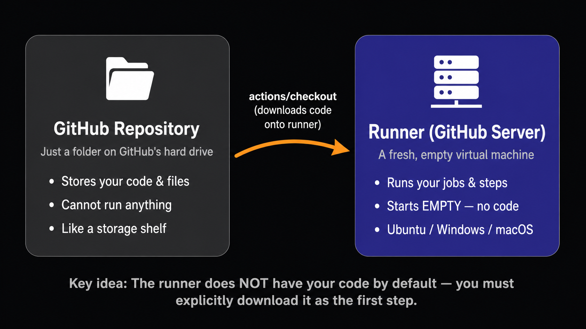
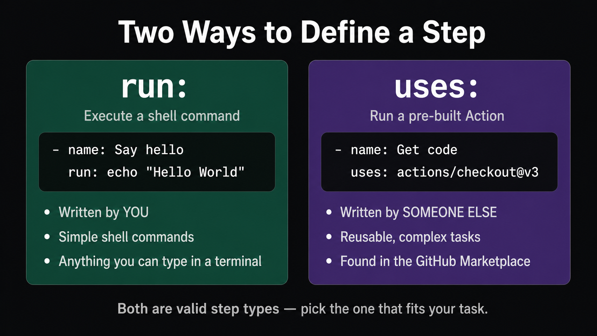

<h2 style="color: #0E6655;">Workflow Events, Actions & Runners — Complete Notes</h2>

<h3 style="color: #3498DB;">Creating Workflow Files Locally vs on GitHub</h3>

You have **two ways** to create a workflow file:

1. **On GitHub** (browser editor) — like we did before in the Actions tab.
2. **Locally** (in your code editor) — recommended for real projects.

**Why locally?**
- A workflow is just a file in your project — it lives in your code anyway.
- Editing locally feels more natural alongside your other code.
- **No difference** in structure or keywords — both methods produce the same result.

**Required folder structure:**

```
your-project/
└── .github/             ← name MUST be ".github" (mandatory)
    └── workflows/       ← name MUST be "workflows" (mandatory)
        └── test.yml     ← file name is up to YOU
```

> **Rule:** Only the file name (`test.yml`) is your choice. Folder names `.github` and `workflows` are fixed.

---

<h3 style="color: #9B59B6;">Workflow Triggers / Events — A Deeper Look</h3>

> "Events" and "triggers" mean the same thing — they're used interchangeably.

GitHub Actions offers **tons of events** you can listen to. They fall into two main categories:

<h4 style="color: #74B9FF;">1. Repository-Related Events</h4>

These are triggered by activity inside your repository:

| Event | Triggered When |
|-------|----------------|
| `push` | A commit is pushed to the repo |
| `pull_request` | A pull request is opened/closed/updated |
| `create` | A new branch or tag is created |
| `fork` | Someone forks the repository |
| `issues` | An issue is opened, edited, deleted, etc. |
| `release` | A new release is published |

Many events have **variations / activity types**. For example, `pull_request` can be triggered specifically when a PR is **opened**, **closed**, **reopened**, etc. — you can control exactly which variation triggers your workflow.

<h4 style="color: #55EFC4;">2. Other Events</h4>

| Event | What It Does |
|-------|-------------|
| `workflow_dispatch` | Manual trigger — adds a "Run workflow" button on GitHub |
| `repository_dispatch` | Trigger via REST API request |
| `schedule` | Run on a cron schedule (e.g. daily at 8:00 AM) |
| `workflow_call` | Allow this workflow to be called by other workflows |

> **Reference:** Search "GitHub Actions events" for the official documentation page that lists every event, its variations, and how to use each one. This page is the go-to resource for any use case.

---

<h3 style="color: #E67E22;">Choosing the Right Event for Our Use Case</h3>

**Goal:** Run automated tests every time new code is pushed to the repo.

**Best event for this:** `push`

```yaml
on: push
```

- This is the **simple form** — runs on every push to any branch.
- More advanced forms exist (e.g. only push to `main`, or only certain file paths) — covered later.
- `push` is one of the **most-used events** in GitHub Actions.

---

<h3 style="color: #16A085;">Defining the Job & Runner</h3>

After `name` and `on`, we define `jobs`:

```yaml
jobs:
  test:
    runs-on: ubuntu-latest
    steps:
      - ...
```

- `test` is our chosen job identifier (free choice).
- `runs-on: ubuntu-latest` — picks the **runner** (the server that executes the steps).
- Inside `steps:` we define what the job actually does.

---

<h3 style="color: #E74C3C;">⚠️ CRITICAL: Runner vs Repository</h3>

This is one of the **most important concepts** to understand:

> Your job runs on a **GitHub-owned server** (a runner). It does **NOT** run inside your repository.

**Why this matters:**

| | Repository | Runner |
|---|---|---|
| What it is | A folder on GitHub's hard drive | A virtual server |
| Holds your code? | Yes | **No — by default it's empty** |
| Runs jobs? | No (it's just storage) | Yes |

**The implication:**
- The runner has **no idea** what's in your repo.
- If a step needs your code (e.g. to run tests), you must **explicitly download** the code onto the runner first.
- This is done as the **first step** of most jobs, using a special action called **checkout**.

> Think of it this way: GitHub gives you a fresh, empty machine. You have to tell it "go fetch my code from this repo" before doing anything with that code.



---

<h3 style="color: #F39C12;">Introduction to Actions (The Building Block)</h3>

So far we've used `run` to execute shell commands. But there's another way to define what a step does — **Actions**.

**What is an Action?**
- A custom or third-party application that performs a **complex, frequently repeated task**.
- Pre-built and reusable — you don't have to write the logic yourself.
- Example: downloading code from a GitHub repo onto the runner.

**Important note:**
> Earlier we sometimes called workflows "actions" loosely — but **technically, an Action is a separate, specific feature**. Workflows contain jobs and steps; an Action is a reusable building block used inside a step.

**`run` vs `uses` — Two ways to define a step:**

| Keyword | What It Runs | Written By |
|---------|--------------|------------|
| `run` | A shell command (e.g. `echo "Hello"`, `npm test`) | You — directly in the YAML |
| `uses` | A pre-built Action | Someone else (GitHub, community, or you) |

```yaml
steps:
  - name: Run a command
    run: echo "Hello"

  - name: Use an action
    uses: actions/checkout@v3
```



---

<h3 style="color: #2ECC71;">The GitHub Actions Marketplace</h3>

- A **central place** to browse Actions you can use in your workflows.
- Even though it's called a "Marketplace," **all Actions are free**.
- You can also find **Apps** there — but Apps are a different feature; for workflows, only **Actions** matter.

**Types of Action creators:**

| Creator Type | Trust Level |
|--------------|-------------|
| **Verified creator** (e.g. GitHub team) | Highest — has a verified badge |
| Other companies | Trusted but verify yourself |
| Community / open-source | Read the source before using |
| Your own custom Actions | Full control (covered later) |

> Security is important when using third-party Actions — the course will cover this in detail later.

**Examples of Actions you can find:**
- Checkout code (`actions/checkout`)
- Install Node.js (`actions/setup-node`)
- Cache dependencies
- Deploy to cloud providers (AWS, Azure, etc.)
- And many more for any task you can imagine.

---

<h3 style="color: #8E44AD;">Using an Action: The Checkout Action</h3>

The **checkout action** downloads your repo code onto the runner. It's the most common first step.

<h4 style="color: #A29BFE;">Step 1 — Use the `uses` keyword</h4>

Instead of `run`, you use `uses` to call an Action:

```yaml
- name: Get code
  uses: actions/checkout@v3
```

<h4 style="color: #74B9FF;">Step 2 — Understand the Identifier</h4>

The format is: **`<owner>/<action-name>@<version>`**

```
actions/checkout@v3
   │       │       │
   │       │       └── Version (locked in)
   │       └── Action name
   └── Owner (here it's the official GitHub "actions" account)
```

- The identifier is essentially the **GitHub link** to the repository that holds the action's code.
- You'll find this identifier on the Action's Marketplace page.

<h4 style="color: #FDCB6E;">Step 3 — Lock the Version with `@v3`</h4>

**Why versioning matters:**
- Action authors update their code over time.
- Updates may include **breaking changes** that change behavior.
- Locking to a specific version (e.g. `@v3`) ensures your workflow keeps working as expected.
- Update the version manually only when **you're ready** to test the new behavior.

> **Recommendation in this course:** Use `@v3` for the checkout action so your workflow matches the lecture.

<h4 style="color: #55EFC4;">Step 4 — The `with` Keyword (Configuration)</h4>

Some Actions accept **configuration parameters** via the `with` keyword:

```yaml
- name: Get code
  uses: actions/checkout@v3
  with:
    some-option: some-value
```

- `with` belongs to `uses` (it configures the Action you're using).
- Which keys are accepted depends on each individual Action — **always check that Action's docs**.
- For checkout, defaults are fine — it auto-uses the repo the workflow belongs to.
- We **don't** need `with` for our checkout step.

---

<h3 style="color: #27AE60;">Step 2: Installing Node.js (Setup Node Action)</h3>

After downloading the code, we typically need to install dependencies and run tests. For that we need Node.js.

<h4 style="color: #A8E6CF;">Preinstalled Software on Runners</h4>

> GitHub publishes a list of software preinstalled on each runner.

- Search "GitHub Actions Supported Software" → pick your runner (e.g. `ubuntu-latest`).
- You'll see all preinstalled languages and tools.
- For Ubuntu — Node.js is **already installed**.

<h4 style="color: #D4A5FF;">When to Use the `setup-node` Action</h4>

Even though Node.js is preinstalled, you might want a **specific version**:

```yaml
- name: Install NodeJS
  uses: actions/setup-node@v3
  with:
    node-version: 18
```

**What's happening here:**
- `actions/setup-node@v3` — official action by GitHub to install Node.js.
- `with: node-version: 18` — installs **Node.js 18** (overrides the runner's default version, e.g. 16).
- Adding the `with` block here is **necessary** because the action needs to know which version to install.

> Even though it's not strictly required (since Node is preinstalled), using this action is good practice — and good for **practicing the use of Actions in general**.

---

<h3 style="color: #2980B9;">Workflow File So Far</h3>

```yaml
name: Test Project

on: push

jobs:
  test:
    runs-on: ubuntu-latest
    steps:
      - name: Get code
        uses: actions/checkout@v3
      - name: Install NodeJS
        uses: actions/setup-node@v3
        with:
          node-version: 18
```

**What this does (so far):**
1. Triggered on every `push` to the repo.
2. Runs on a fresh Ubuntu server.
3. Step 1 — Downloads your code onto the runner.
4. Step 2 — Installs Node.js 18.

(Next lecture: install dependencies and run tests.)

---

<h3 style="color: #FD79A8;">Quick Reference Table</h3>

| Concept | Keyword / Example | Purpose |
|---------|-------------------|---------|
| Workflow trigger | `on: push` | When to run the workflow |
| Job container | `jobs:` | Holds all jobs |
| Runner OS | `runs-on: ubuntu-latest` | Picks the server |
| Run a command | `run: echo "Hi"` | Execute shell command |
| Use an action | `uses: actions/checkout@v3` | Run a pre-built Action |
| Action config | `with: { key: value }` | Pass parameters to an action |
| Version pin | `@v3` | Lock action version |

---

<h3 style="color: #D35400;">Quick Summary — Key Takeaways</h3>

- Workflow files can be created **locally** in `.github/workflows/` — same structure as on GitHub.
- **Events/triggers** define when a workflow runs — there are many (`push`, `pull_request`, `schedule`, `workflow_dispatch`, etc.).
- The `push` event triggers the workflow on every commit pushed to the repo.
- A **runner is NOT your repository** — it's a fresh server. You must **download your code onto it** as the first step.
- **Actions** are the second core building block (alongside `run` commands) — pre-built, reusable scripts.
- Use the `uses` keyword (not `run`) to call an Action.
- Always **pin a version** (e.g. `@v3`) to avoid breaking changes.
- Use `with` to pass configuration to an Action (when needed).
- The **Marketplace** is where you browse and find Actions for any task.
- `actions/checkout` → downloads your repo code onto the runner.
- `actions/setup-node` → installs a specific Node.js version on the runner.
